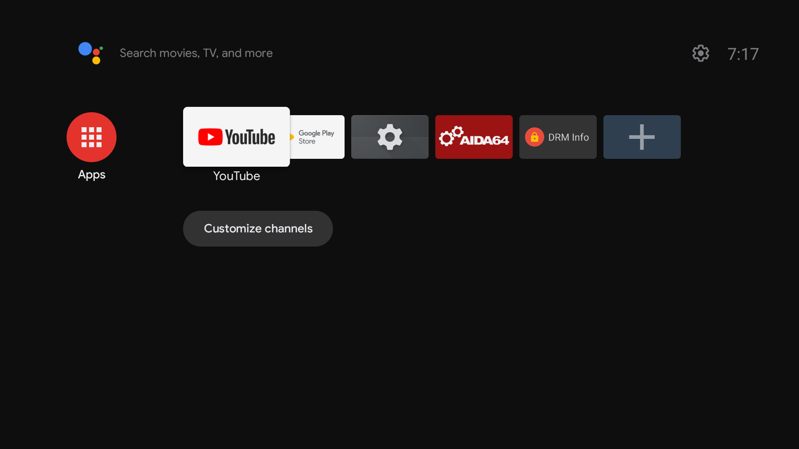

## Waydroid Android TV builds (LineageOS 18.1/20)
[Demonstration video on YouTube](https://www.youtube.com/watch?v=NK1xxoJpPkQ)
### Features
- Full-featured Android TV build without GApps (can be installed manually)
- VA-API video acceleration support for Intel iGPUs
- Built with Mesa 24.2

### Known bugs
- Preinstalled keyboard/Gboard not working, use [LeanKey keyboard](https://github.com/yuliskov/LeanKeyKeyboard) instead
- Settings app crashes when developer options turned on
- Tell me if there are anything else :)

  
Known bugs <b>(only on ATV 13 builds)</b>

   
  <ul>
    <li>Broken permission system</li>
    <li>Broken Play Store</li>
  </ul>

### Installation (Usage/Install GApps)
> [!NOTE]
> Android TV 11 builds are more stable and recommended for daily use

- Check [Release](https://github.com/supechicken/waydroid-androidtv-build/releases/latest) page for more information

### Source code
All modified materials used for building ATV images can be found in the [Waydroid-ATV](https://github.com/Waydroid-ATV) organization

### Screenshots

  
Expand

  
  
  

