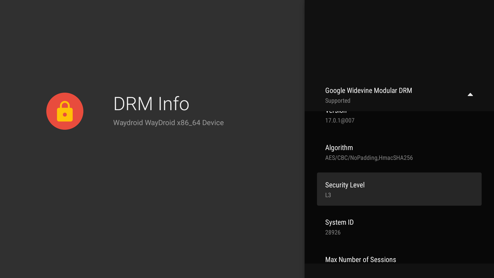

# Android TV 11/13 builds for Waydroid
[Demonstration video on YouTube](https://www.youtube.com/watch?v=NK1xxoJpPkQ)
## Features
- Full-featured Android TV 11/13 build with GApps preinstalled
- VA-API video acceleration support for Intel/AMD GPUs
- Works with libhoudini ARM translation layer
- Works with Widevine L3 (only for x86-64 at this moment)
- Built with Mesa 25.1

## Known bugs
- Tell me if there are anything else :)

## Installation (Usage/Install GApps)
- Check [Release](https://github.com/supechicken/waydroid-androidtv-build/releases/latest) page for more information

## Source code
All modified materials used for building ATV images can be found in the [WayDroid-ATV](https://github.com/WayDroid-ATV) organization

## Screenshots

