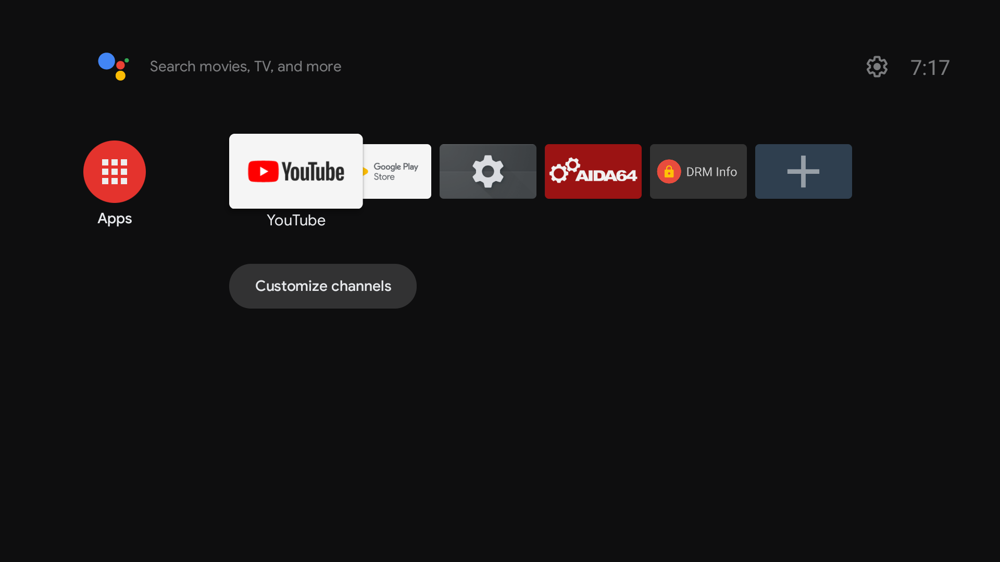
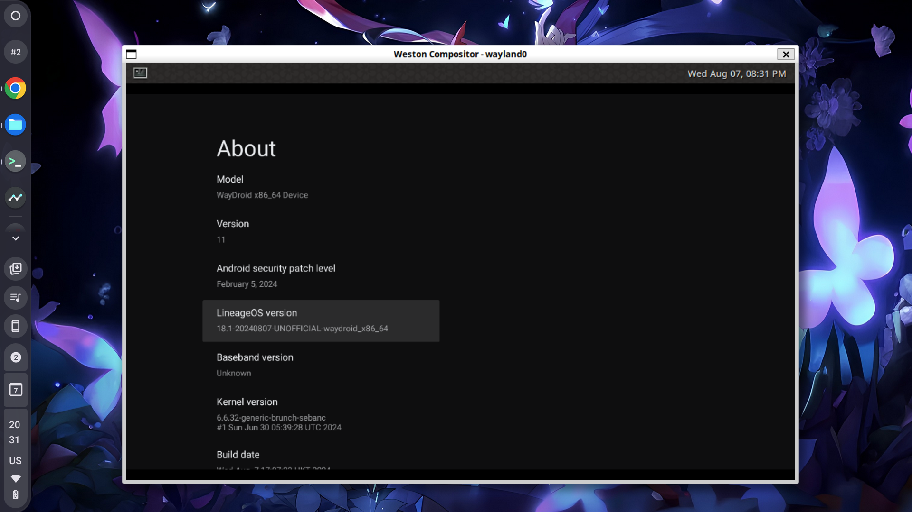
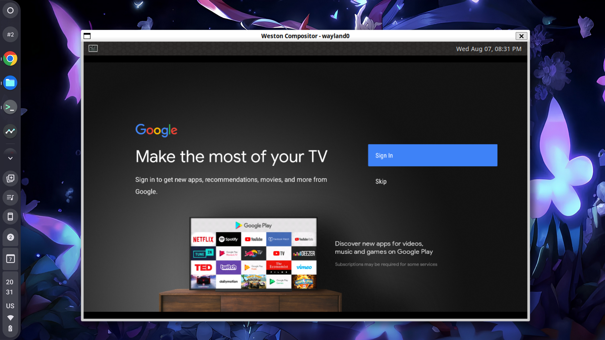
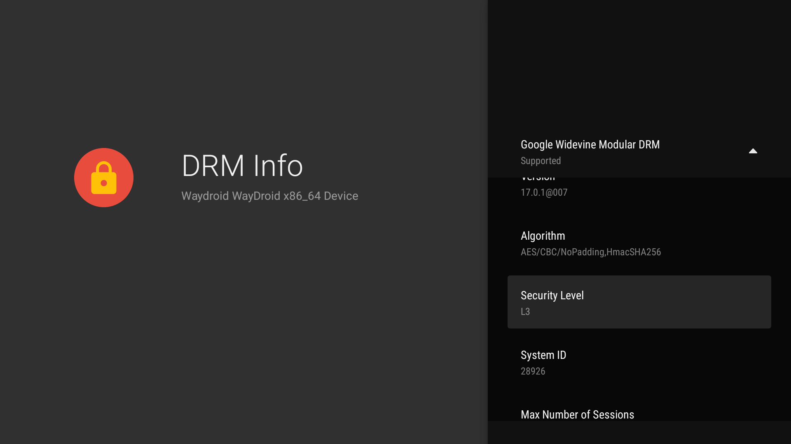

# Android TV builds for Waydroid
[Demonstration video on YouTube](https://www.youtube.com/watch?v=NK1xxoJpPkQ)

## Features
- Full-featured Android TV 13 builds (based on LineageOS 20.0) with/without GApps preinstalled
- VA-API video acceleration support for Intel/AMD GPUs
- Built-in libhoudini ARM translation layer
- Built-in Widevine L3 (only for x86-64 at this moment)
- Built with Mesa 25.3

## Overview
So far, there are already some Android TV x86 ROMs (like [LineageOS TV x86](https://github.com/LineageOS-TV-x86)) that allow users to turn their PC into an Android TV box. Meanwhile, the CPU performance of most modern x86 systems is somehow overkill for ATV usage.

This project allows users to run ATV on top of an existing Linux OS, with their Linux things (like Samba for NAS or even Steam for gaming) running simultaneously, which makes the system resources fully utilized.

## Installation
Check [Releases](https://github.com/supechicken/waydroid-androidtv-build/releases/latest) page for more information
  
## Reporting bugs
Open a new issue [here](https://github.com/supechicken/waydroid-androidtv-build/issues) if you encounter any bugs with my builds (please check existing issues before submitting a new one)

## Build instructions
If you would like to build ATV images on your own (for the latest security patches, etc.), check [BUILDING.md](https://github.com/supechicken/waydroid-androidtv-build/blob/main/BUILDING.md) for detailed instructions

## Source code
All modified materials used for building ATV images can be found in the [WayDroid-ATV](https://github.com/WayDroid-ATV) organization

## Screenshots

