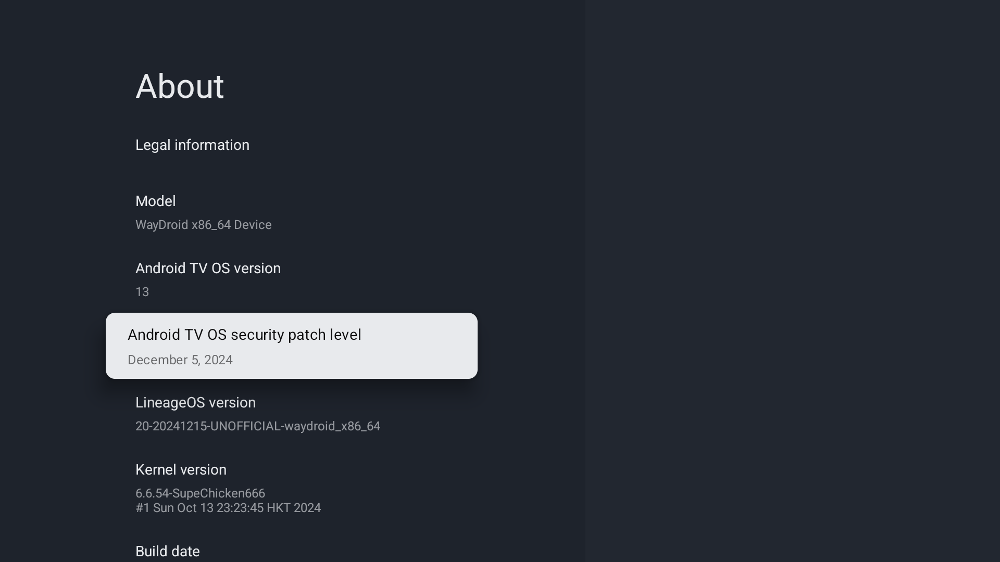

## Waydroid Android TV builds (LineageOS 18.1)
### Features
- Full-featured Android TV build without GApps (can be installed manually)
- VA-API video acceleration support for Intel iGPUs
- Built with Mesa 24

### Known bugs
- Preinstalled keyboard/Gboard not working, use [LeanKey keyboard](https://github.com/yuliskov/LeanKeyKeyboard) instead
- Tell me if any others :)

### Installation (Usage/Install GApps)
- Check [Release](https://github.com/supechicken/waydroid-androidtv-build/releases/tag/20240807) page for more information

### Screenshots

